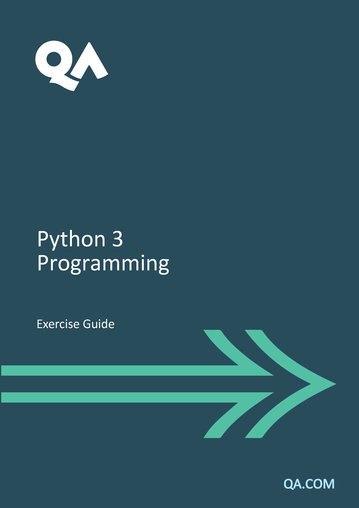

# Environment Set-Up


Your instructor will direct you to the courseware folder for this course which typically will have the path Courseware\QAPYTH3.

## Jupyter Notebooks


1.   Goto the Courseware folder and 
* Open a console window (command prompt):
* Type :
```
jupyter lab
```

2. That should start the jupyter labs environment and launch your browser

   * To run this on your home PC you will need to run the following on your console first

     ```
     pip install jupyterlab
     ```

     

3. You should be able to navigate to your individual notebooks and execute notebooks cells using CTRL ENTER

4. Your instructor will demo how to do this

 

## Pycharm

 

This is a free to download dev environment for Python by JetBrains. We are using the Community Edition

1. A link to PyCharm will be on the Desktop of your machine and should be on the taskbar as well.

2. Open Pycharm, accept the defaults.

3. Your instructor should walk you through this process

 

## Python IDLE

 

A link to the Python IDLE Console and Editor should be on your desktop.

Your instructor will walk you through using IDLE.


# Exercises


The exercises are always made up of three parts, How much you do is dependent on your previous:

* Programming Experience
* Python Experience

## Parts

1. Jupyter Lab Tutorials
   * At the end of every jupyter lab for a chapter is a tutorial on the subject of that chapter eg **Functions**. 
   * You might want to refresh your memory of the chapter by running through the tutorial and running/changing the code in the examples to aid your understanding
2. Jupyter Lab TODO Items
   * At the top of the Lab are a set of TODO instructions asking you to complete specific Python coding tasks
   * Have a go at doing these
3. Python Challenges
   * To give you more challenge there will always be a set of challenges that you will write as Python scrips in PyCharm
   * Do as many of these as you can in the time

There will usually be far more tutorial, lab amd challenge material than time available.

**So**:
* **Remember this is not a race** 
* Decide what will be most helpful and relevant to you in support of your learning. 
  * That may vary for you depending on the chapter.
* Try to experience a mix of 
  * Jupyter tutorials/labs and 
  * Python Pycharm challenges
* Ask for help whenever you need it
* Most of all ... **Have fun!**

<div style="page-break-after: always"></div>

# Exercise 1

No Exercise set

# Exercise 2 - Variables and Type


## Objectives

·   To understand how to create variables

·   To be able to assign value to and retrieve data from variables

·   To be able to convert between data types

 

## Activity

 

1.   From the running Jupyter Lab notebook in your browser open notebook

* 02_Fundamental_Variables\Variables and Data Types.ipynb

2.   Follow the instructions for Quicklabs 1 to 3 as directed by your instructor

* A solution can be found in the solution folder

3.   Now take a look at the challenges if you have time. Try as many as you feel comfortable attempting.

 

## Challenges

Using Pycharm:

### Challenge 1 - If you would like a further challenge

 

*If you haven’t done this already, use Pycharm to open the Labs folder. Ask your instructor for help with this.*

 

The previous Jupyter Notebook asked you to calculate simple interest now we will get you to write a script to calculate compound interest.

 

1. Open challenge1.py and look at the script
2. All of the data necessary to carry out the following calculation is supplied in some form
3. Using the simple interest equation:
4. 

$$
A = P(1 +\frac{r}n)^{nt}
$$


A     =     final amount

P     =     initial principal balance

r      =     interest rate

n     =     number of times interest applied per time period

t      =     number of time periods elapsed

4. Calculate the final amount using this formula 

5. Outputs some useful results

 

### Challenge 2

 

Write a program to calculate the gravitational force between the Earth and the Sun using the `gravitational_force` variable. 

 

The formula for gravitational force is as follows:

Are you listen to me and kind of guy do you know what my fucking head but

$$
F = \frac{GMm}{r^2}
$$


F is the total gravitation force. 

G is the gravitational constant. 

M and m are the masses to be compared, 

and r is the distance between those masses.

 

The values you will need to calculate the gravitation force of the Earth and Sun are:

G = 6.67 x 10-11

MSun = 2.0 x 1030

mEarth = 6.0 x 1024

r = 1.5 x 1011


### Challenge 3


 The height of a projectile (*y*) from a gun (ignoring air resistance) is given as:

$$
 y = y0 + x tan θ - \frac{gx2}{2(v0 cos θ)^2}
$$


where:

*g*    : Acceleration due to gravity:  9.81 m/s squared

*v0*   : the initial velocity m/s

*θ*      : (theta) elevation angle in radians

*x*       : the horizontal distance travelled

*y0*    : height of the barrel (m)

 

1. Write a Python program to answer the following question:

 

* At a barrel height of 1m, after a horizontal distance of 0.5m, an elevation of 80 degrees, and an initial velocity of 44 m/s, what is the height of the projectile?

2.  To convert degrees (deg) to radians use:

 

$theta = deg * \frac{pi}{180}$

 

* You will need to import some math methods:

```
from math import pi, tan, cos
```


There will be a further *if time allows* question which expands on this code after the Collections chapter.

 

### Challenge 4

 

* Create a new program called **F1.py**, it will explore some of the mathematics involved in managing a Formula 1 racing car.

* The task of this program (at first), is to answer a question:

    *  "During a race of **45** laps, what is the minimum fuel requirement?"

 You will need to know the fuel consumption found during the race qualifying, which is **2.25** kg for each lap.

1. In this exercise, we will make a few more modifications to F1.py. First, we will add an extra fuel load, and then we are going to calculate the lap time based on the weight of fuel, which naturally decreases each lap. 

2. In the previous exercise, we worked out the minimum fuel requirement for a 45 lap race and stored this in a variable named fuel_requirement. To fill the tank with the absolute minimum amount of fuel would be foolhardy, and not allow the drivers any margin for manoeuvre. Typically, a car will carry an extra 50% for contingency (multiply the minimum by 1.5). So what fuel will be carried by our fictional F1 car at the start of the race? 

3. Modify your F1.py program to calculate this. 

4. You might think it odd that fuel is measured in kilograms rather than litres or gallons. This is because the weight of fuel is critical to the way a Formula One car performs.  

 

The qualifying lap time was 80.45 seconds, but that was with only 5kg of fuel: **each 10 kg of fuel increases the lap time by 0.35 seconds**.

* What will be the lap time for the first lap with all the required fuel on board?


<div style="page-break-after: always"></div>

# Exercise 3 – Control Flow

 

## Objectives

·   To Understand how to control the flow of execution

·   To use while loops

·   To use for loops

 

## Activity

 

1. From the running Jupyter notebook in your browser open notebook Controlling_Execution_Flow.ipynb

2. Follow the instructions for the Quicklabs as directed by your instructor

3. Now take a look at the challenges if you have time. Try as many as you feel comfortable attempting.

 

## Challenges

  Using Pycharm:

### Challenge 1

 

1. Write an income tax calculation engine using the following thresholds (or look the latest ones up for your location (remember Scotland and Wales may vary!)

| **Band**               | **Taxable income**  | **Tax rate** |
| ---------------------- | ------------------- | ------------ |
| **Personal Allowance** | Up to £12,500       | 0%           |
| **Basic rate**         | £12,501 to £50,000  | 20%          |
| **Higher rate**        | £50,001 to £150,000 | 40%          |
| **Additional rate**    | over £150,000       | 45%          |

2. You may need to take into account of and capture:

* Taxable Employment income
* Savings and Dividend income net of allowances
* Pension income
* Income from property
* Self employed income

It's up to you what to include. Make it as simple or as complex as you want. Maybe start simple and refine?

### Challenge 2

This is a general coding challenge. Combining skills learned so far,

* We have provided you with challenge2.py
* Inside it is there is some code that uses a while loop (not a for!) to calculate a sequence of numbers
  * It will become clear later in the course why we are doing this
* Your challenge(s) should you choose to accept them are to:

Based on the way the this while loop works (it calculates and prints its value one by one from inside a  loop)

1. Write code to print a sequence of prime numbers limited to the count provided by the count variable. Lookup how to determine if a number is prime.

2. Do the same thing with a third loop to print a sequence of Fibonacci numbers limited to the count provided by the count parameter. 

* A Fibonacci number is the sum of it’s two previous numbers in the sequence. )

  * Sequence begins with 0,1,1 – Third value 1 results from sum of first, 0 + second, 1. 0 + 1 = 1. Next value will be 1+1 = 2 etc.

### Challenge 3

For this optional challenge you will need to work  on the provided physical or virtual environment. At the time of writing this challenge won't tun on OSX.

* We have provided you with challenge3.py

It uses a demo package that we are using to display a Traffic Light.

* **set_state** function takes a parameter with the following effect
```
"000"  All Off
"100"  Red Off Off
"110"  Red Amber Off
"010"  Off Amber Off
"001"  Off Off Green

```
Write some code to:
1. Display the UK traffic light sequence with pauses  (amber delay is approx 2.8s, make up the other pauses) between each state
2. Make it a perpetual sequence
3. Define a country variable that holds either "uk" or "us"
4. Make your sequence work for both UK and US traffic signals (google the difference)

<div style="page-break-after: always"></div>

# Exercise 4 – Strings


## Objectives

·   To understand how to work with and process strings


## Activity

1. From the running Jupyter notebook in your browser open notebook strings.ipynb

2. Follow the instructions for the Quicklabs as directed by your instructor

3. Now take a look at the challenges if you have time. Try as many as you feel comfortable attempting.

 

## Challenges

 Using Pycharm:

### Challenge 1

 

* In this challenge we will write a simple Caesar Cipher. It simple takes a string and adds one to the character code of each character in the message creating a new message.

1. Follow the comment instructions in challenge1.py

2. But that’s pretty easy to break so if you want an extra challenge you could try writing a Vignère Cipher. To do this. for example:

* Offset the 1st character by 25
* Offset the 2nd character by 14
* Offset the 3rd character by 17
* Offset the 4th character by 10
* Repeat across the sequence of characters so the 5th character would be offset by 25 etc.

Usualy the offsets are determined using a cipher key provider by the person encrypting the message. 

3. Write some Python code to do this.

 When you have tried out basic encryption why not research it a bit further? You will discover in the real world we don’t usually rely on these basic algorithms but they are fun to write!

 

### Challenge 2

 

1. Open the challenge2.py module.

2. Notice there some code which uses the bitcoin_prices module to load some price data and prints it out in a loop

3. It returns comma separated data with the following price data

* close,high,low,open,timestamp,volume

 

4. We want you to use your knowledge of sting handling to extract the data from the commas and perform the following calculations

* Total Volume

* Average close price

* Maximum High

* Minimum Low

5. If you really want to challenge yourself try creating a Simple 20 day Moving Average for the Close price.

* Start with the first price and work forwards

* There won’t be an SMA for the first 19 days!

6. Print the Date, Close Price, SMA

   

# Exercise 5 - Collections 

##  

## Objectives

To understand how to create and manipulate lists and work with dictionaries

 

## Activity

 

1. From the running Jupyter labs in your browser open notebook 05_Collection\Collections.ipynb

2. Read the tutorials and follow the instructions for the Quicklabs

## Challenges 

Using Pycharm:

### Challenge 1

 

1. Open morse.py and take a look at it

*  It contains a codes dictionary containing alpha letters and their Morse code equivalents

* Use the dictionary to translate the message string into Morse code

* You could use a time.sleep(<seconds>) call to delay displaying each Morse code letter

* Remember spaces and punctuation aren’t included!


### Challenge 2

 

1. Open quiz.py and follow the ToDo comment

2. You are asked to create a quiz from the dictionary returned from loading a JSON quiz file

3. Use input and some for loops to create an interactive quiz

 

### Challenge 3

 

1. Write a program that generates a sequence of unique, sorted random numbers.

* You can using the **random** module and the **randint** function.

 

| **Requirement**                                              | **Criteria**                                                 |
| ------------------------------------------------------------ | ------------------------------------------------------------ |
| Generate a list of random numbers                            | Should be six numbers in list but this may  change  ·     Numbers in list should be unique  ·                                        Range of numbers between 1 and 55 (inclusive) |
| Display the list of random numbers                           | Should  be arranged as a vertical list                       |
| Count how many iterations it takes to generate a second  list of random numbers identical to the first | All members must be identical                                |
| Display the number of iterations attempted                   | How many matches have been  attempted?                       |

 

# Exercise 6 - Regular Expressions

##  

## Objectives

To understand how to create and manipulate lists and work with dictionaries

 

## Activity

 

1. From the running Jupyter labs in your browser open notebook 06_RegularExpressions\RegularExpressions.ipynb

2. Read the tutorials and follow the instructions for the Quicklabs

## Challenges 

 Using Pycharm in **06_regular_expressions** folder:

### Challenge 1

We want you to: 

* Take postcodes.txt and cleanse the data so that we only have valid postcodes left. 
* Either print the valid postcodes or, of you know how at this point, write them to a new file.

1. Open postcodes.py and follow the Todo instructions.

### Challenge 2

Open expenses01.txt. It contains mileage and expense data in an inconsistent data form.

* Each record starts with a date
* Followed by either M or mileage or E for expense

We will focus on mileage. Mileage expenses have:

* Mileage rate
* Miles Travelled
* Start Postcode
* End Postcode
* Total Claimed
* Description

Mostly the fields are separated by spaces but not always.

We want you to:

1. Define a regex to flexibly match the mileage lines
2. Use groups to help you extract the data from the strings
3. Calculate the mileage claim amount = mileage_rate * miles_travelled
4. Determine the total claimed and calculated amounts and report any discrepancy.
5. Compare with the solution


# Exercise 7    - Data Storage and File Handling

## Objectives

To  be able to create, store and read data to and from files. 

## Activity

1. From the running Jupyter labs in your browser open notebook 07_data_storage\datastorage.ipynb

2. Read the tutorials and follow the instructions for the Quicklabs

## Challenges 

 Using Pycharm in **06_data_storage** folder:

### Challenge 1

1. Open challenge1.py
2. Follow the instruction in the comments

### Challenge 2

1. Open challenge2.py
2. Follow the instruction in the comments

### Challenge 3

1. Open chhaleng3.py
2. Use the csv package to process the movies.csv file
   * You will need to do some research
   * Calculate the number of 
     * TV Shows 
     * Movie

### Challenge 4

Investigate the following packages by doing some research

* json
* sqlite

Can you get either or both of these packages persisting and retrieving data? You use our movie data example from earlier as inspiration!


# Exercise 8 - Functions

## Objectives

To learn how to write and use functions

## Activity

From the running Jupyter labs in your browser open notebook 08_functions\functions.ipynb

1. Read the tutorials and follow the instructions for the Quicklabs

## Challenges


### Challenge 1

1. Open challenge1.py
2. Follow the TODO comments

### Challenge 2

1. Open challenge2.py
2. Follow the TODO comments

### Challenge 3

1. Open challenge3.py
2. Follow the TODO comments

### Challenge 4

*The following challenge can only be taken on on the classroom or virtual lab you have been given. You could also run it on a Windows 10 machine if you **pip install pihat_widget***

The following code is given:

```
import pihat_widget as ph
import time

if __name__ == '__main__':

    #            r   g  b
    red_color = 255, 0, 0
    light = ph.LEDMatrix()
    light.set_pixel(0, 0 , red_color)
    time.sleep(5)
    light.close()
```

It displays a matrix of Led lights. Each light can be addressed using it's x, y coordinates.

0, 0 is top left.

1, 0 is top, second from left

The third parameter is a tuple that codes an RGB colour.

Your challenge is to write reusable functions to: 

1. Manage a traffic light  display
2. Should have Red, Amber Green
3. Lights should have a perpetual sequence
   * Stop
   * Prepare to Go
   * Go
   * Prepare to Stop
   * Stop
   * Repeat

4. Amber and Red/Amber should be 2.8 s delay
5. Other delays are at your discretion
6. Pair program if appropriate

# Exercise 9 - Advanced Collections

## Objectives

To learn how to write and use comprehensions, generators and produce deep copies of collections.

## Activity

From the running Jupyter labs in your browser open notebook 09_advanced_collections\advanced.ipynb

1. Read the tutorials and follow the instructions for the Quicklabs

## Challenges

1. Open challenge1.py in Pycharm
   * Write an **frange** function that create an equivalent to the range function but with floating point numbers
2. Open challenges2.py in Pycharm
   * Create a dictionary comprehension of letters and equivalent Morse code sequences based on
     * Message
     * Intercepted Morse code for message

# Exercise 10 - Modules

## Objectives

To learn how to work with modules and packages.

## Activity

From the running Jupyter labs in your browser open notebook 10_modules\modules.ipynb

1. Read the tutorials there are no quicklabs.

## Challenges

1. Open challenge1.py in Pycharm
   * You will create a library package and a module inside it. Then you will re-sue it
   * Follow the ToDo instructions
2. Open challenges2.py in Pycharm
   * Modularize the timer functions the best way you can
   * Write a script to reuse the module you have written

# Exercise 11 - Classes and OO Programming

## Objectives

To learn how to write classes.

To  learn about object oriented programming principles.

## Activity

From the running Jupyter labs in your browser open notebook 11_oo\oo.ipynb

1. Read the tutorials follow the instructions for the quick labs

## Challenges

1. Open challenge1.py and follow the TODO instructions
2. Open challenge2.py and follow the TODO instructions
3. Open challenge3.py and write an OO version of the traffic light you may have worked on earlier
   * This challenge will only work on Windows or Linux machines. At the time of writing the pihat_widget module install from pypi.org has issues.
4. Write an OO implementation of a Traffic Light that will eventually be able to work with
   * UK Traffic Lights
   * US Traffic Lights
5. UK Traffic lights follow the sequence
   * Red
   * Red Amber
   * Green
   * Amber
   * Red
6. The Delay on Red and Green is up to you
7. The Delay on Amber for UK lights is 2.8s
8. You will need to research the US settings and sequences if you get to it
9. You might want to as advanced topics
   * Use inheritance
   * Consider if a traffic light should be responsible for determining and controlling its own sequence

# Exercise 12 - Exceptions and Error Handling

## Objectives

To learn how to handle errors.

## Activity

From the running Jupyter labs in your browser open notebook 12_exceptions\exceptions.ipynb

1. Read the tutorials follow the instructions for the quick labs

## Challenges

### Challenge 1

1. Open challenge1.py and follow the TODO comments.

### Challenge 2

1. Open mytimer.py
2. There are two functions, **start_timer()** and **end_timer()**, which should be called in that order. 
    * What if **end_timer()** was called without a **start_timer()** before it? We need to raise an exception in our timer module if that happens.

3. Use **mytimer.py** and detect if **start_timer()** was called previously from the **end_timer()** function. We suggest that you initialize and reset your global time to **None** in **end_timer()** after a successful run, and test that. We use **None** because zero is a valid time. Which exception would be appropriate to raise?

Test it using **challenge2.py**.

4. Now, in **challenge2.py**, handle the error elegantly with an appropriate error message.

